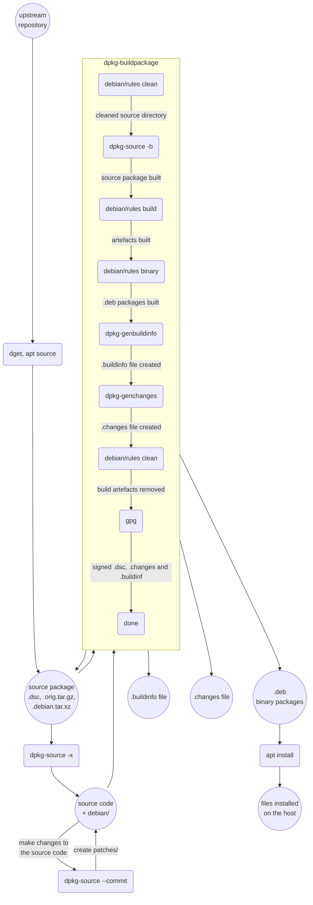

+++
title = "Debian Packaging"
date = "2023-03-01T23:55:28+01:00"
author = ""
authorTwitter = "" #do not include @
cover = ""
tags = ["debian", "packaging"]
keywords = ["", ""]
description = "A Debian packaging guide"
showFullContent = false
readingTime = true
hideComments = false
color = "" #color from the theme settings
toc = true
+++

How do you create the `.deb` packages that you use on your system to install
software ? Let's walk through a simple example with the `hello` package, a
package that installs an executable to display "Hello World!". We'll modify it
to display a personalized message with your first name and repackage it.

```bash
$ apt show hello

Package: hello
Version: 2.10-2
Priority: optional
Section: devel
Maintainer: Santiago Vila <sanvila@debian.org>
Installed-Size: 287 kB
Depends: libc6 (>= 2.14)
Conflicts: hello-traditional
Breaks: hello-debhelper (<< 2.9)
Replaces: hello-debhelper (<< 2.9), hello-traditional
Homepage: http://www.gnu.org/software/hello/
Tag: devel::debian, devel::examples, devel::lang:c, devel::lang:posix-shell,
 devel::packaging, implemented-in::c, interface::commandline,
 role::documentation, role::program, scope::utility, suite::debian,
 suite::gnu
Download-Size: 56,1 kB
APT-Manual-Installed: yes
APT-Sources: http://deb.debian.org/debian bullseye/main amd64 Packages
Description: example package based on GNU hello
 The GNU hello program produces a familiar, friendly greeting.  It
 allows non-programmers to use a classic computer science tool which
 would otherwise be unavailable to them.
 .
 Seriously, though: this is an example of how to do a Debian package.
 It is the Debian version of the GNU Project's `hello world' program
 (which is itself an example for the GNU Project)
```

Before we start, install the `dpkg-dev` and `devscripts` packages to have access to
build commands like `dpkg-source` and `dch`:

```bash
$ sudo apt install dpkg-dev devscripts
```
These install a lot of dependencies so I usually use a dedicated building box
to do the packaging.


## Structure of a source package

Each binary *.deb* package originates from a debian *source package*. You can
download the sources of a package by using the `apt source` command.
A relevant "deb-src" line must be present in your `sources.list` file.

```bash
$ apt source --download-only hello
```

This will download 3 files in the current directory :
- `hello_2.10-2.debian.tar.xz`
- `hello_2.10-2.dsc`
- `hello_2.10.orig.tar.gz`

This set of files is the *source package* of our binary package *hello*.

The `.dsc` file is the *Debian source control* file. It describes the source
package: the files that it contains, the version, the format, the
maintainer, etc.

```bash
$ cat hello_2.10-2.dsc

-----BEGIN PGP SIGNED MESSAGE-----
Hash: SHA256

Format: 3.0 (quilt)
Source: hello
Binary: hello
Architecture: any
Version: 2.10-2
Maintainer: Santiago Vila <sanvila@debian.org>
Homepage: http://www.gnu.org/software/hello/
Standards-Version: 4.3.0
Build-Depends: debhelper-compat (= 9)
Package-List:
 hello deb devel optional arch=any
Checksums-Sha1:
 f7bebf6f9c62a2295e889f66e05ce9bfaed9ace3 725946 hello_2.10.orig.tar.gz
 a35d97bd364670b045cdd86d446e71b171e915cc 6132 hello_2.10-2.debian.tar.xz
Checksums-Sha256:
 31e066137a962676e89f69d1b65382de95a7ef7d914b8cb956f41ea72e0f516b 725946 hello_2.10.orig.tar.gz
 811ad0255495279fc98dc75f4460da1722f5c1030740cb52638cb80d0fdb24f0 6132 hello_2.10-2.debian.tar.xz
Files:
 6cd0ffea3884a4e79330338dcc2987d6 725946 hello_2.10.orig.tar.gz
 e522e61c27eb0401c86321b9d8e137ae 6132 hello_2.10-2.debian.tar.xz

-----BEGIN PGP SIGNATURE-----

iQEzBAEBCAAdFiEE1Uw7+v+wQt44LaXXQc5/C58bizIFAlzZsmAACgkQQc5/C58b
izLpZAf/c8SfVAmQNaj2OXK08n2AmrWwE177tg4ELZLLDlXK0O//2eoc/507jdTT
SOcvb8E7ABmqVZeJmoeEAf7G/YNuOw/gC/h64mb8fzqekxjc2ME5ZjCyhX2A8PSU
gN7KF7pdTuzjZzlBqciao00mOJFlLLsLgy913MbKUQv5jWNMEHp66k5oCsvwPCKZ
F3XzVD+rdviG4DOLdWERCfoToIFcTW2Bb//A/lMovaH90qETSm1Vu+0YpU75Zvc8
hc7o8ceESilCvIZBnKu7z7XjDuv1cJsQcwd4d/g9ExIttOUVFr6ZsjO2OTgz9Dtr
NoZBXv/SrHo5rEVf7MvorSX4z276yw==
=SItA
-----END PGP SIGNATURE-----
```
The file is signed by the maintainer to ensure its authenticity.

Let's look inside the archives.

The `orig.tar.gz` file contains the source code for our software.

```bash
$ tar -tf hello_2.10.orig.tar.gz

hello-2.10/
hello-2.10/COPYING
hello-2.10/tests/
hello-2.10/tests/greeting-1
hello-2.10/tests/traditional-1
hello-2.10/Makefile.am
hello-2.10/config.in
hello-2.10/maint.mk
hello-2.10/README
hello-2.10/INSTALL
hello-2.10/NEWS
...
```

The `debian.tar.xz` archive contains the `debian/` folder which contains all the
necessary metadata for packaging.

```bash
$ tar -tf hello_2.10-2.debian.tar.xz

debian/
debian/changelog
debian/control
debian/copyright
debian/rules
debian/rules-old
debian/source/
debian/source/format
debian/watch
```

`dpkg-source` is a tool for manipulating debian source packages. We can use it
to extract the `.orig.tar.gz` and `.debian.tar.xz` archives of our source
package into a `hello-2.10/` directory :

```bash
$ dpkg-source -x hello_2.10-2.dsc 

dpkg-source: info: extraction de hello dans hello-2.10
dpkg-source: info: extraction de hello_2.10.orig.tar.gz
dpkg-source: info: extraction de hello_2.10-2.debian.tar.xz
```

We now have access to the (upstream) source code and the debian/ metadata directory:

```bash
$ ls hello-2.10/

ABOUT-NLS   AUTHORS    ChangeLog    config.in  configure.ac  COPYING  doc          hello.1  lib  maint.mk     Makefile.in  NEWS  README      README-release  tests   TODO
aclocal.m4  build-aux  ChangeLog.O  configure  contrib       debian   GNUmakefile  INSTALL  m4   Makefile.am  man          po    README-dev  src             THANKS
```

> 📝 __NOTE__: without the `--download-only` option, `apt source` downloads the source
> package and decompresses it at once.

As an alternative to `apt source`, `dget` is another useful tool when dealing
with debian source packages. It allows you to download an entire source package
given the URL to the *.dsc* file, by inspecting the *.dsc* file and downloading
any additional files that it references. It then verifies the validity of the
signatures (with `dscverify`) and extract the source package (with `dpkg-source -x`).
Example : 

```bash
$ dget http://deb.debian.org/debian/pool/main/h/hello/hello_2.10-2.dsc

dget: retrieving http://deb.debian.org/debian/pool/main/h/hello/hello_2.10-2.dsc
dget: retrieving http://deb.debian.org/debian/pool/main/h/hello/hello_2.10.orig.tar.gz
dget: retrieving http://deb.debian.org/debian/pool/main/h/hello/hello_2.10-2.debian.tar.xz

hello_2.10-2.dsc:
      Good signature found
   validating hello_2.10.orig.tar.gz
   validating hello_2.10-2.debian.tar.xz
All files validated successfully.

dpkg-source: info: extraction de hello dans hello-2.10
dpkg-source: info: extraction de hello_2.10.orig.tar.gz
dpkg-source: info: extraction de hello_2.10-2.debian.tar.xz
```
After which we are left with the following :
```bash
$ ls

hello-2.10  hello_2.10-2.debian.tar.xz  hello_2.10-2.dsc  hello_2.10.orig.tar.gz
```

Great ! Now, a lot of the work you do when packaging is inside the `debian` directory
(from the *.debian.tar.xz* archive). Here are some of the important files in this directory:

- the `debian/control` file describes metadata about the package like its
  description, its architecture and its relationship to other packages
(dependencies, conflicts, etc). The first block describe the source package, and
the subsequent blocks describe the associated binary package(s) :

  ```bash
  $ cat debian/control

  Source: hello
  Section: devel
  Priority: optional
  Maintainer: Santiago Vila <sanvila@debian.org>
  Standards-Version: 4.3.0
  Build-Depends: debhelper-compat (= 9)
  Homepage: http://www.gnu.org/software/hello/
  Rules-Requires-Root: no

  Package: hello
  Architecture: any
  Depends: ${shlibs:Depends}, ${misc:Depends}
  Conflicts: hello-traditional
  Replaces: hello-traditional, hello-debhelper (<< 2.9)
  Breaks: hello-debhelper (<< 2.9)
  Description: example package based on GNU hello
   The GNU hello program produces a familiar, friendly greeting.  It
   allows non-programmers to use a classic computer science tool which
   would otherwise be unavailable to them.
   .
   Seriously, though: this is an example of how to do a Debian package.
   It is the Debian version of the GNU Project's `hello world' program
   (which is itself an example for the GNU Project).
  ```

- the `debian/changelog` file tracks the revisions of the package, with the
  associated names, versions and distributions :

  ```bash
  $ cat debian/changelog

  hello (2.10-2) unstable; urgency=medium

    * Fix version skew. Closes: #928887.
    * Drop debian/compat and use new syntax to specify compat level.
    * Standards-Version: 4.3.0 (no changes for this).
    * Rules-Requires-Root: no

   -- Santiago Vila <sanvila@debian.org>  Mon, 13 May 2019 20:06:50 +0200

  hello (2.10-1) unstable; urgency=low

    * New upstream release.
    * debian/patches: Drop 01-fix-i18n-of-default-message, no longer needed.
    * debian/patches: Drop 99-config-guess-config-sub, no longer needed.
    * debian/rules: Drop override_dh_auto_build hack, no longer needed.
    * Standards-Version: 3.9.6 (no changes for this).

   -- Santiago Vila <sanvila@debian.org>  Sun, 22 Mar 2015 11:56:00 +0100
  ```

- the `debian/rules` file is the executable that will be run for building
  the package. It's a makefile which contain recipes for building the
artefacts, cleaning them, etc.
  ```bash
  $ cat debian/rules

  #!/usr/bin/make -f
  %:
	  dh $@

  override_dh_auto_clean:
	  [ ! -f Makefile ] || $(MAKE) distclean

  override_dh_installdocs:
	  dh_installdocs NEWS
  ```

- the `debian/source/format` file indicates the format of the source package
  ```bash
  $ cat debian/source/format

  3.0 (quilt)
  ```

  Here we're dealing with a *3.0 (quilt)* source package, that's why it
contains the 3 files `.dsc`, `.orig.tar.gz` and `.debian.tar.xz`.


## Building the binary packages

Let's start by building the binary packages for the source package that we got. To
do that, we first have to install the build dependencies that are specifically
required for building this package. You do that with the following command :

```bash
$ apt build-dep hello
```

To build the binary package from our current source package, we then use the
`dpkg-buildpackage` command, with the *-us* and *-uc* parameters that will tell
it not to sign our package.

```bash
$ cd hello-2.10/
$ dpkg-buildpackage -us -uc
```

Done! if you list the parent directory, you can find some additional files:
```bash
$ ls ..

hello-2.10  hello-dbgsym_2.10-2_amd64.deb  hello_2.10-2.debian.tar.xz  hello_2.10-2.dsc  hello_2.10-2_amd64.buildinfo  hello_2.10-2_amd64.changes  hello_2.10-2_amd64.deb  hello_2.10.orig.tar.gz
```

- the `.buildinfo` file contains information about the build environment, such
  as the version of the build dependencies and the architecture of the build
  system
- the `.changes` file contains data about the build like the related section of
  the changelog and the checksum of the artefacts produced by the build
- the `.deb` files are the binary packages

Behind the scenes, the dpkg-buildpackage command will invoke multiple
commands. You can see the different steps of the process in the
[man](https://manpages.debian.org/bullseye/dpkg-dev/dpkg-buildpackage.1.en.html)
of dpkg-buildpackage. Here's an overview :
1. run `dpkg-source --before-build` to prepare the build environment
2. check that build dependencies (that we just installed above) are satisfied
3. run the `clean` recipe of `debian/rules` to clean the build tree
4. run `dpkg-source -b` to generate the source package
5. run the `build` recipe of `debian/rules` to build the software followed by
   the `binary` recipe to create the `.deb` binary packages
6. run `dpkg-genbuildinfo` to generate a .buildinfo file
7. run `dpkg-genchanges` to generate a .changes file
8. run the `clean` recipe of `debian/rules` again
9. run `dpkg-source --after-build`, generally to undo what `dpkg-source
   --before-build` did
10. run the `check` hook
11. sign the `.dsc`, `.changes` and `.buildinfo` files with gpg
12. run the `done` hook

Ok, we can now install the created binary packages with apt :

```bash
$ sudo apt install ../hello_2.10-2_amd64.deb
```

Launch the newly installed `hello` command to check that it's working properly:

```bash
$ hello
Hello, world!
```

## Make modifications and rebuild the package
Let's do some modification to the code. In the `hello-2.10/src/hello.c`, modify
the default message on line 60 to greet you by your first name,
from `Hello, world!` to `Hello, Mathieu!` for example:

```c
59 /* Having initialized gettext, get the default message. */
60 greeting_msg = _("Hello, Mathieu!");
```

Also modify the `hello-2.10/tests/hello-1` test file, line 24, as the tests will
be run during the build:

```c
23 cat <<EOF > hello-test1.ok
24 Hello, Mathieu!
25 EOF
```

Now that our modifications are done, let's put them into the *debian/changelog*
file and increment the version number of our package. The `dch`
command is made for this:

```bash
$ cd hello-2.10/
$ dch -i
```

We're then prompted to edit the message in the changelog. Put a message that
reflect your changes, for example:

```text
hello (2.10-2.1) UNRELEASED; urgency=medium

  * Customize the default greeting message

 -- Mathieu Rollet <mrollet@local>  Wed, 01 Mar 2023 17:41:08 +0100
```
Notice that the version number has automatically been increased from `2.10-2`
to `2.10-2.1`. If you want to explicitly pass the new version to use you can
use `dch -v <VERSION>` instead of `dch -i`.

Ok, save that file. We'll now try to build the new version of our package !

```bash
$ dpkg-buildpackage -us -uc
```

The command produces the following error :
```text
dpkg-source: info: using source format '3.0 (quilt)'
dpkg-source: info: building hello using existing ./hello_2.10.orig.tar.gz
dpkg-source: info: local changes detected, the modified files are:
 hello-2.10/src/hello.c
 hello-2.10/tests/hello-1
dpkg-source: info: you can integrate the local changes with dpkg-source --commit
dpkg-source: error: aborting due to unexpected upstream changes, see /tmp/hello_2.10-2.1.diff.4RRfd1
dpkg-buildpackage: error: dpkg-source -b . subprocess returned exit status 2
```

The build process was not expecting the changes that we made (the original
files are available for comparison in the `.orig.tar.gz` archive). In order to
complete the build process, we need to create a *patch* that will help document
and keep track of the changes we made. Use `dpkg-source` to create the patch:

```bash
$ dpkg-source --commit
```

It will ask you for the name of the patch, you can name it
"customized-greetings". You're then prompted to edit the patch file.
Once saved, you can find the patch file in the `debian/patches` directory.

```bash
$ cat debian/patches/customized-greetings

Description: Customize the default greeting message

 hello (2.10-2.1) UNRELEASED; urgency=medium

   * Customize the default greeting message
   * Display "Hello, <FIRSTNAME>!" instead of "Hello, world!"

Author: Mathieu Rollet <mrollet@local>

---
The information above should follow the Patch Tagging Guidelines, please
checkout http://dep.debian.net/deps/dep3/ to learn about the format. Here
are templates for supplementary fields that you might want to add:

Origin: <vendor|upstream|other>, <url of original patch>
Bug: <url in upstream bugtracker>
Bug-Debian: https://bugs.debian.org/<bugnumber>
Bug-Ubuntu: https://launchpad.net/bugs/<bugnumber>
Forwarded: <no|not-needed|url proving that it has been forwarded>
Reviewed-By: <name and email of someone who approved the patch>
Last-Update: 2023-03-01

--- hello-2.10.orig/src/hello.c
+++ hello-2.10/src/hello.c
@@ -57,7 +57,7 @@ main (int argc, char *argv[])
 #endif
 
   /* Having initialized gettext, get the default message. */
-  greeting_msg = _("Hello, world!");
+  greeting_msg = _("Hello, Mathieu!");
 
   /* Even exiting has subtleties.  On exit, if any writes failed, change
      the exit status.  The /dev/full device on GNU/Linux can be used for
--- hello-2.10.orig/tests/hello-1
+++ hello-2.10/tests/hello-1
@@ -21,7 +21,7 @@ export LANGUAGE LC_ALL LC_MESSAGES LANG
 
 tmpfiles="hello-test1.ok"
 cat <<EOF > hello-test1.ok
-Hello, world!
+Hello, Mathieu!
 EOF
 
 tmpfiles="$tmpfiles hello-test1.out"
```

Let's try building the packages again :
```bash
$ dpkg-buildpackage -us -uc
```

This time it works and we have additional files in the parent directory :

```bash
$ ls ..

hello-2.10                       hello-dbgsym_2.10-2_amd64.deb  hello_2.10-2.1.dsc              hello_2.10-2.1_amd64.changes  hello_2.10-2.debian.tar.xz  hello_2.10-2_amd64.buildinfo  hello_2.10-2_amd64.deb
hello-dbgsym_2.10-2.1_amd64.deb  hello_2.10-2.1.debian.tar.xz   hello_2.10-2.1_amd64.buildinfo  hello_2.10-2.1_amd64.deb      hello_2.10-2.dsc            hello_2.10-2_amd64.changes    hello_2.10.orig.tar.gz
```
The build created new `.dsc` and `.debian.tar.xz` source package files for the
new *2.10-2.1* version, as well as the new `.buildinfo`, `.changes` and `.deb`
artefacts for the *2.10-2.1* version.

Install and run your new version of `hello` to see the difference !

```bash
$ sudo apt install ../hello_2.10-2.1_amd64.deb
$ hello
Hello, Mathieu!
```
Congratulations ! You just downloaded the source package of a .deb package, modified
its source code, and rebuilt an upgraded version of it.

To wrap it up, here is a (simplified) graph summarizing the workflow
we worked with for packaging :



## Links
- [Structure of a source package](https://debian-handbook.info/browse/stable/sect.source-package-structure.html)
- [Debian New Maintainers' Guide](https://www.debian.org/doc/manuals/maint-guide/index.en.html)
- [Introduction to Debian packaging](https://www.debian.org/doc/manuals/packaging-tutorial/packaging-tutorial.en.pdf)
- [Guide for Debian Maintainers](https://www.debian.org/doc/manuals/debmake-doc/index.en.html)

man pages:
- [dpkg-source](https://manpages.debian.org/bullseye/dpkg-dev/dpkg-source.1.en.html)
- [dpkg-buildpackage](https://manpages.debian.org/bullseye/dpkg-dev/dpkg-buildpackage.1.en.html)
- [dget](https://manpages.debian.org/bullseye-backports/devscripts/dget.1.en.html)
- [dscverify](https://manpages.debian.org/bullseye-backports/devscripts/dscverify.1.en.html)
- [dch](https://manpages.debian.org/bullseye/devscripts/dch.1.en.html)

